# Hi there, I'm Diego Zea 👋

### Mobile & Web developer from Colombia 🇨🇴

I build cross-platform mobile apps (Flutter, Kotlin, previously Ionic/React Native) and modern web apps with **React + TypeScript + Firebase**, applying multi-tenant SaaS patterns (Tailwind, atomic Firestore writes, role-based route guards).

- 🌍 Based in Colombia
- 🟢 Open to work — looking for new opportunities
- 📱 Shipped apps on Google Play: [Descúbrelo](https://play.google.com/store/apps/details?id=com.requiemz.fake_it_game_app) · [Firmar PDF](https://play.google.com/store/apps/details?id=com.requiemz.signature_app) · [Gastos Rápidos](https://play.google.com/store/apps/details?id=com.requiemz.bills_manager) · [QR scanner](https://play.google.com/store/apps/details?id=com.requiemz.qr_scan_app)
- 💬 Ask me about: Flutter, React, Firebase, mobile release pipelines (Play Store)

 

## 🧰 Languages & Tools

**Mobile**

**Web**

**Backend & Databases**

**Tools & Cloud**

 

## 📊 GitHub Stats

  
  

  

 

## 📱 Featured Projects

### Descúbrelo

Party game — find the impostor before it finds you.

  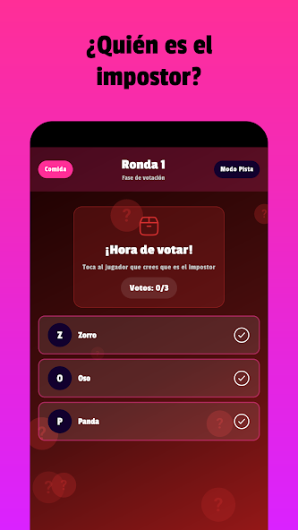
  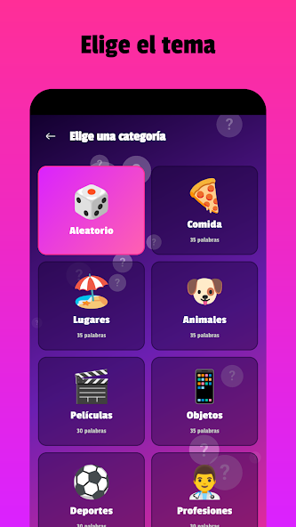
  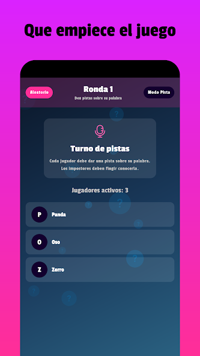

[Play Store ↗](https://play.google.com/store/apps/details?id=com.requiemz.fake_it_game_app)

### Firmar PDF – Firma fácil

Sign documents and PDFs in seconds.

  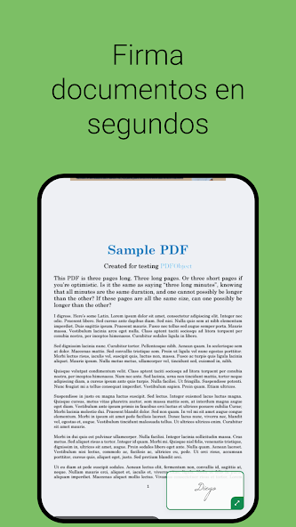
  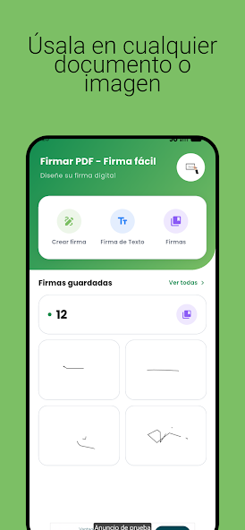
  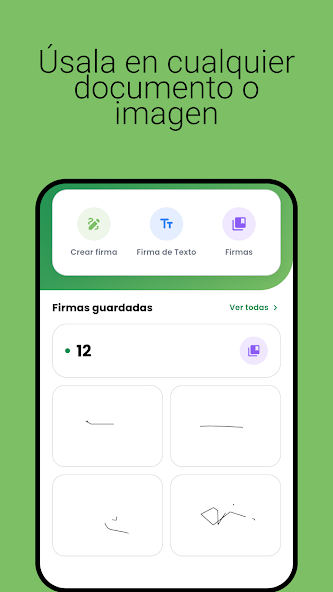

[Play Store ↗](https://play.google.com/store/apps/details?id=com.requiemz.signature_app)

### Gastos Rápidos – Control

Track your spending and see where your money goes.

  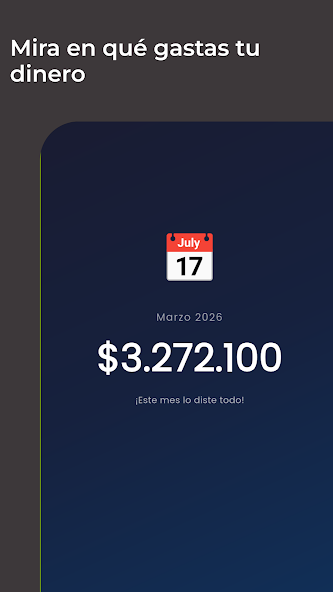
  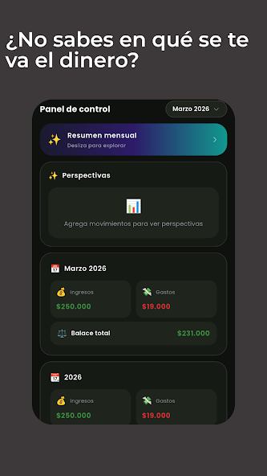
  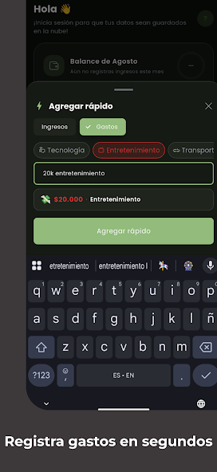

[Play Store ↗](https://play.google.com/store/apps/details?id=com.requiemz.bills_manager)

### QR Scanner

Scan QR and barcodes instantly, save and organize links.

  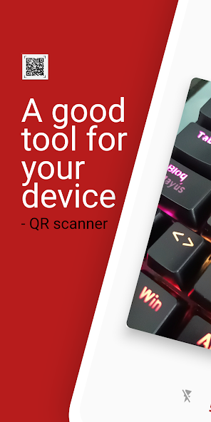
  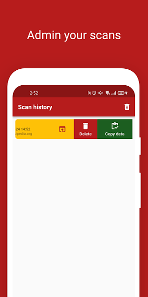
  

[Play Store ↗](https://play.google.com/store/apps/details?id=com.requiemz.qr_scan_app)

 

## 🌐 Web Projects

### A&MA Planeta Azul S.A.S.

React site built for an environmental consulting firm (air quality, noise & emissions monitoring) in Boyacá, Colombia.

[planetaazulsas.co ↗](https://planetaazulsas.co/)

### Portfolio

My personal portfolio site.

[manty-2ec22.web.app ↗](https://manty-2ec22.web.app/)

 

## 📦 Open Source

**overlay_pop_up** — Flutter plugin to show draggable overlay pop-ups on top of other apps on Android, even while running in the background. Swipe-to-dismiss and bidirectional messaging between the overlay and the main app.

  

 

## 📫 Let's connect

<!-- TODO: agrega aquí tu LinkedIn / email si quieres mostrarlos públicamente -->

- 💼 Portfolio: [manty-2ec22.web.app](https://manty-2ec22.web.app/)

  

